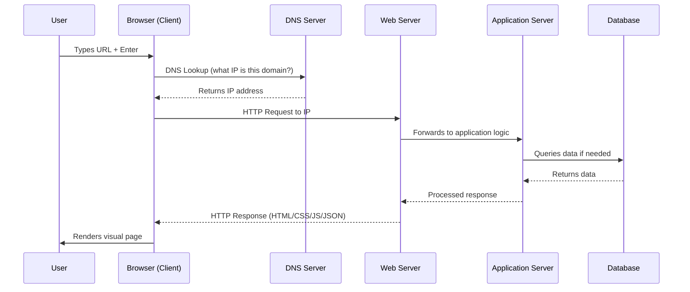

# Output 1: Concept File

---

# The Client-Server Model

## TL;DR

Every interaction on the internet follows a simple pattern: a client requests, a server responds. Understanding this model is the foundation of everything in DevOps - from deploying a web app to designing infrastructure that handles millions of concurrent users. If you don’t understand request-response, you don’t understand the internet.

## Full Picture

### What Is the Client-Server Model?

The client-server model is the fundamental communication architecture of the internet. It describes a relationship between two roles: one side initiates a request (the client), and the other side processes that request and returns a response (the server). This isn’t a hardware distinction - it’s a role distinction. The same physical machine can act as a client in one interaction and a server in another.

When you type a URL into your browser and hit Enter, your browser becomes the client. It translates your action into an HTTP request, sends it across the internet through multiple network hops, until it reaches the machine hosting the website. That machine - the server - processes the request, locates the appropriate resources, and sends back the data. Your browser then renders that data into the visual page you see. This entire round trip happens in milliseconds.

The key insight: the client always initiates. The server never reaches out unprompted - it sits and waits for incoming requests, then responds. This reactive nature of servers is a core architectural principle that shapes how we build, deploy, and scale applications.

### The Client - More Than Just a Browser

In the context of the internet, a client is software, not a person. It can be a web browser on a laptop, a mobile app on a phone, a CLI tool like `curl`, an IoT sensor, or even another server making an API call. What makes it a client is the act of initiating a request for data or a service.

Every time you open Instagram, your app sends a request to Instagram’s servers asking for your feed data. The app is the client. Every time a microservice calls another microservice’s API endpoint, the calling service is acting as the client. This role-based thinking is critical in DevOps, where you’re constantly reasoning about which component talks to which, who initiates, and who responds.

### The Server - A Professional Kitchen, Not a Home Stove

A useful analogy: if a personal computer is a home kitchen - small scale, flexible, low traffic - then a server is a restaurant kitchen. It handles high volume, concurrent orders, and must maintain consistency and uptime under pressure.

Servers are typically more powerful than consumer machines, but not because of magic hardware. They’re optimized for throughput rather than user experience. More RAM to handle concurrent connections, faster network interfaces, redundant storage, but often no GPU and no monitor. Their operating systems (usually Linux) are stripped down and tuned for serving requests, not for running desktop applications.

A server must be ready to “serve dishes” (handle requests) at high velocity, without crashing, and with full adherence to its configuration - the “recipes” it follows. This is precisely where DevOps enters the picture: ensuring those servers are provisioned correctly, monitored continuously, and can recover from failure automatically.

### What Happens During a Request - The Full Lifecycle

The lifecycle of a single HTTP request involves more steps than most people realize:

This sequence - DNS resolution, TCP connection, HTTP request, server-side processing, database query, response, and client-side rendering - is the heartbeat of the internet. Every single page load, API call, and file download follows some variation of this pattern.

### Modern Application Architecture - The City Analogy

A modern application isn’t a single program running on a single machine. It’s a system of interconnected layers, much like a city’s infrastructure:

|Layer|City Analogy|Role|Technologies|
|---|---|---|---|
|**Frontend**|Streets and storefronts|What the user sees and interacts with|React, Next.js, HTML/CSS/JS|
|**Backend**|Water, electricity, sewage systems|Business logic, processing, orchestration|FastAPI, Node.js, Django, Go|
|**Database**|City registry / archives|Persistent data storage and retrieval|PostgreSQL, MongoDB, Redis|
|**Infrastructure**|Roads, power grid, telecom|The platform everything runs on|Linux, Docker, Kubernetes, AWS|
|**DevOps**|City planning and maintenance|Ensuring all layers work in harmony|CI/CD, monitoring, IaC, automation|

When a city works well, residents don’t think about what happens beneath the surface. When an application works well, users don’t think about the backend, the database queries, or the load balancer distributing their request across multiple server instances. But someone has to think about it - that someone is the DevOps engineer.

### “Works on My Machine” vs. Production-Ready

One of the most important distinctions in this topic is the gap between development and production. The presentation uses an excellent analogy: a car can drive perfectly in a parking lot, but that doesn’t mean it’s ready for the highway.

An application that works on a developer’s laptop operates under ideal conditions - single user, no network latency, no resource contention, predictable inputs. Production is the highway: high speed, unpredictable traffic, extreme weather conditions, and zero tolerance for breakdowns.

|Aspect|Development (“Parking Lot”)|Production (“Highway”)|
|---|---|---|
|Users|1 (the developer)|Thousands to millions|
|Uptime expectation|None|99.9%+ SLA|
|Error handling|Print statement + restart|Structured logging, alerts, auto-recovery|
|Configuration|Hardcoded, .env file|Secrets management, environment variables|
|Monitoring|Manual observation|Prometheus, Grafana, PagerDuty|
|Deployment|`python app.py`|CI/CD pipeline, blue-green, canary|
|Infrastructure|Localhost|Load balancers, CDN, auto-scaling groups|

DevOps is the discipline that transforms a parking-lot prototype into a highway-ready vehicle. It’s the bridge between “it works” and “it works reliably, at scale, under pressure, and we know about it immediately when it doesn’t.”

### The Internet Is Just Computers Talking to Computers

Strip away all the complexity, and the internet reduces to one simple idea: computers communicating with other computers. Every computer can identify other computers (via IP addresses), and requests find their way to the correct destination through layers of networking (DNS, routing, TCP/IP). The sophistication is in the scale and reliability, not in the concept itself.

This foundational understanding matters because as a DevOps engineer, you’ll constantly work at the seams between these communicating systems - configuring how services find each other (service discovery), how traffic flows between them (load balancing, reverse proxies), how they authenticate with each other (TLS, tokens, certificates), and what happens when communication fails (retries, circuit breakers, fallbacks).

## Why It Matters for DevOps

The client-server model isn’t just theory you learn and forget. It’s the mental model you use every single day as a DevOps engineer.

When you configure Nginx as a reverse proxy, you’re placing it between clients and your application servers, routing requests to the right backend. When you set up a load balancer in AWS, you’re distributing client requests across multiple server instances. When you build a CI/CD pipeline, the runner acts as a client to your Git server, pulls the code, builds it, and pushes the artifact to a registry (where it then becomes a server for deployment tools to pull from).

Container orchestration with Kubernetes is fundamentally about managing servers that serve requests - scaling them up when traffic increases, replacing them when they crash, routing traffic only to healthy instances. Every `Service`, `Ingress`, and `Pod` in Kubernetes maps directly to this client-server model.

Monitoring and observability tools (Prometheus, Grafana) exist because servers don’t complain when they’re overloaded - they just slow down and die. A restaurant kitchen won’t call you to say it’s about to collapse; you need sensors, dashboards, and alerts. DevOps builds that observation layer.

Even infrastructure-as-code (Terraform, Ansible) is a client-server interaction: Terraform acts as a client to the AWS API, requesting resources. The AWS API is the server that provisions them.

## Key Takeaways

- The client-server model is a role-based relationship: clients initiate requests, servers respond. Neither is defined by hardware.
- A “client” in web architecture is software (browser, app, CLI tool, another service), not a human.
- Servers are optimized for throughput and concurrency, not for user experience. They’re restaurant kitchens, not home stoves.
- The full request lifecycle (DNS, TCP, HTTP, processing, DB query, response, render) is the heartbeat of the internet and happens in milliseconds.
- Modern applications are multi-layered systems (frontend, backend, database, infrastructure) that require orchestration to function together.
- “Works on my machine” is not production-ready. Production demands scale resilience, monitoring, automated recovery, and proper configuration.
- DevOps is the discipline that bridges the gap between a working prototype and a production-grade system.
- The entire internet is just computers talking to computers. The complexity is in scale and reliability, not in the concept.

## Iron Rules

**“The client always initiates. The server only responds.”** - This asymmetry shapes every architecture decision. Servers are reactive by design. If you need the server to push data to the client, you’re reaching for WebSockets, SSE, or polling - all of which are workarounds to this fundamental constraint.

**“Working locally is not working.”** - An application that runs on localhost with one user and zero load proves almost nothing about production readiness. DevOps exists because this gap is enormous and dangerous.

**“Every internet interaction you’ve ever had is a request-response cycle.”** - Internalize this. When you debug a 502 error, trace a latency spike, or design a microservices architecture, you’re always reasoning about requests and responses flowing between clients and servers.

**“Servers are professional kitchens - they need professional management.”** - You wouldn’t run a restaurant kitchen without inventory systems, health inspections, and trained staff. Don’t run production servers without monitoring, configuration management, and automation.

## Resources

- [Slide Deck: Client-Server Model](https://www.genspark.ai/slides/01-client-server-model.pdf)
- [IBM Technology - Client Server Architecture (YouTube)](https://www.youtube.com/watch?v=L5BlpPU_muY) - Concise, visual explanation of the model
- [TechWorld with Nana - DevOps Bootcamp: How Applications Work](https://www.youtube.com/watch?v=yMKU3rwV0eo) - Covers this exact topic in a DevOps context
- [ByteByteGo - What Happens When You Type a URL](https://www.youtube.com/watch?v=AlkDbnbv7dk) - Deep dive into the request lifecycle
- [Fireship - 100+ Web Dev Concepts Explained](https://www.youtube.com/watch?v=erEgovG9WBs) - Fast overview that covers client-server, HTTP, DNS, and more
- [MDN Web Docs - How the Web Works](https://developer.mozilla.org/en-US/docs/Learn/Getting_started_with_the_web/How_the_Web_works) - Official reference for the full request cycle

---
