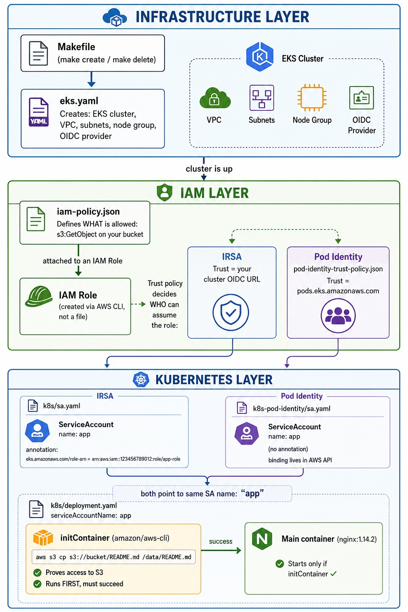

# EKS S3 Access — IRSA & Pod Identity

Lab from the IITC DevOps course, Advanced AWS module. It provisions a real
Amazon EKS cluster and grants a pod read access to an S3 object **two
different ways** — first with **IRSA** (IAM Roles for Service Accounts,
OIDC-based) and then with **EKS Pod Identity** (the newer, service-based
mechanism) — proving both with the exact same workload.



## What this lab proved

A pod running `aws s3 cp s3://david-rubin-eks-irsa-lab-450963/README.md -`
successfully read the object — with **no static AWS keys anywhere** — under
both identity models:

- **IRSA** wires a Kubernetes ServiceAccount to an IAM role through the
  cluster's **OIDC provider**. The pod receives a projected web-identity
  token (`AWS_WEB_IDENTITY_TOKEN_FILE` + `AWS_ROLE_ARN`) and calls
  `sts:AssumeRoleWithWebIdentity`. The role binding lives **in the SA
  annotation** (`eks.amazonaws.com/role-arn`).
- **Pod Identity** drops the OIDC dependency. An on-node **agent** (DaemonSet,
  addon `eks-pod-identity-agent`) serves credentials at
  `http://169.254.170.23/v1/credentials`. The pod gets
  `AWS_CONTAINER_CREDENTIALS_FULL_URI` + a `pods.eks.amazonaws.com` token
  injected automatically. The role binding lives **in AWS** (a *pod identity
  association*), so the SA YAML carries **no annotation**. The role trusts
  `pods.eks.amazonaws.com` via `sts:AssumeRole` + `sts:TagSession`.

| | IRSA | Pod Identity |
|---|---|---|
| Trust | OIDC provider (per cluster) | `pods.eks.amazonaws.com` service principal |
| Where the mapping lives | SA annotation (in-cluster YAML) | Pod identity association (AWS API) |
| Pod env | `AWS_WEB_IDENTITY_TOKEN_FILE`, `AWS_ROLE_ARN` | `AWS_CONTAINER_CREDENTIALS_FULL_URI` |
| Setup per cluster | associate OIDC provider | install `eks-pod-identity-agent` addon |
| Role reuse across clusters | OIDC sub is cluster-specific | one role, many clusters |

## Artifacts (config)

| File | Purpose |
|---|---|
| `eks.yaml` | eksctl `ClusterConfig` — cluster `cluster`, 1× `t3.micro` managed node |
| `Makefile` | `make create` / `make delete` wrappers around eksctl |
| `iam-policy.json` | `s3:GetObject` on the lab bucket |
| `k8s/sa.yaml` | IRSA ServiceAccount (annotated with the IAM role ARN) |
| `k8s/deployment.yaml` | nginx + `amazon/aws-cli` initContainer that reads from S3 |
| `pod-identity-trust-policy.json` | trust policy for `pods.eks.amazonaws.com` |
| `k8s-pod-identity/sa.yaml` | same SA, **no** annotation (binding managed in AWS) |

## Proofs (`images/`)

| File | Shows |
|---|---|
| `00-architecture-layers.jpeg` | architecture diagram |
| `01-cluster-ready.txt` | `kubectl get nodes` — node Ready |
| `02-sa-with-irsa.txt` | ServiceAccount carrying the IRSA role ARN |
| `03-irsa-s3-success.txt` | initContainer reading S3 **via IRSA** |
| `04-pods-running.txt` | nginx Running |
| `05-pod-identity-success.txt` | initContainer reading S3 **via Pod Identity** + injected creds env |
| `06-cleanup-proof.txt` | 0 EKS clusters after teardown |

## Commands used (high level)

```bash
# Part 1 — IRSA
eksctl create cluster -f eks.yaml
aws eks update-kubeconfig --name cluster --region us-east-1
eksctl utils associate-iam-oidc-provider --cluster=cluster --approve
aws iam create-policy --policy-name eks-s3-read-policy --policy-document file://iam-policy.json
eksctl create iamserviceaccount --cluster=cluster --namespace=default --name=app \
  --attach-policy-arn=<policy-arn> --approve
kubectl apply -f k8s/deployment.yaml
kubectl logs <pod> -c s3-fetch          # -> object content, via IRSA

# Part 2 — Pod Identity
aws eks create-addon --cluster-name cluster --addon-name eks-pod-identity-agent
aws iam create-role --role-name eks-s3-pod-identity-role \
  --assume-role-policy-document file://pod-identity-trust-policy.json
aws iam attach-role-policy --role-name eks-s3-pod-identity-role --policy-arn <policy-arn>
kubectl delete sa app -n default && kubectl apply -f k8s-pod-identity/sa.yaml
aws eks create-pod-identity-association --cluster-name cluster \
  --namespace default --service-account app --role-arn <pod-identity-role-arn>
kubectl rollout restart deployment nginx-deployment
kubectl logs <pod> -c s3-fetch          # -> object content, via Pod Identity
```

## Notes / gotchas hit during the run

- **`t2.small` is not Free Tier eligible** on this account → switched to
  `t3.micro` (`fix instance type free tier`).
- **`t3.micro` caps `max-pods=4`** (ENI/IP limit). System pods (aws-node,
  kube-proxy, coredns, pod-identity-agent) fill the node, so the workload
  could not schedule. Mitigations applied: scaled `coredns` to 1, scaled the
  nodegroup to 2 nodes for the Pod Identity phase (agent DaemonSet needs a
  slot alongside the workload).
- **Single replica + RollingUpdate deadlocks** on a full node (the surged new
  pod has nowhere to go). The Deployment uses `strategy: Recreate`.
- **Pod Identity injection is at pod-admission time.** A pod created before
  the association exists never gets the credential env vars — recreate the pod
  after the association.

## Cleanup (teardown — run to stop billing)

```bash
kubectl delete -f k8s/deployment.yaml
aws eks delete-pod-identity-association --cluster-name cluster \
  --association-id <assoc-id> --region us-east-1
aws iam detach-role-policy --role-name eks-s3-pod-identity-role --policy-arn <policy-arn>
aws iam delete-role --role-name eks-s3-pod-identity-role
eksctl delete iamserviceaccount --cluster=cluster --namespace=default --name=app
eksctl delete cluster --name cluster --region us-east-1   # tears down VPC/NAT/nodes
aws iam delete-policy --policy-arn <policy-arn>
```

The S3 bucket (`david-rubin-eks-irsa-lab-450963`) is intentionally left in
place — it costs effectively nothing and is reusable for re-runs.
